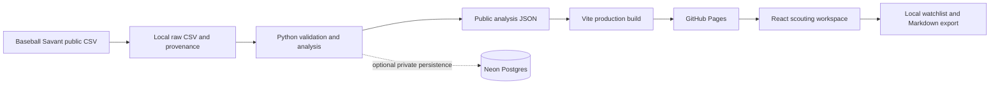
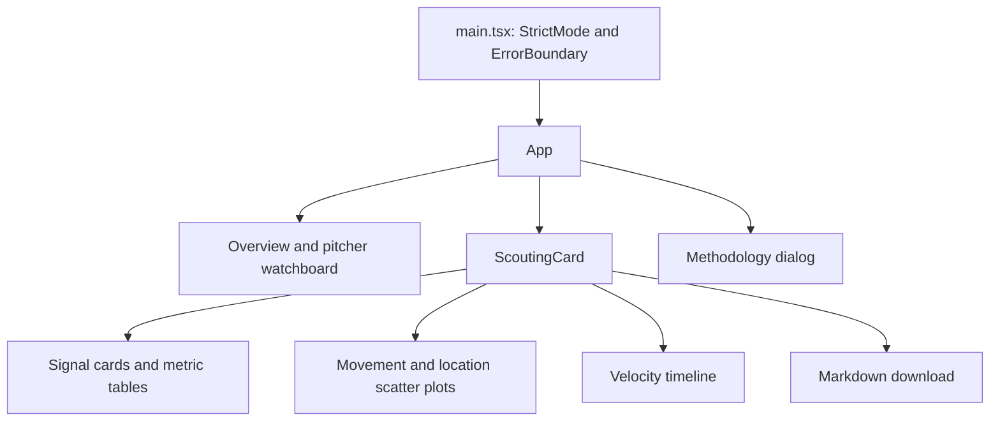

# Architecture

PitchShift turns a bounded set of public Statcast pitches into a reproducible scouting report. Python owns statistical calculations. React displays a versioned JSON report. Optional Neon storage supports private research without becoming a dependency for opening the public application.

## Boundaries and ownership

| Layer | Source | Responsibility |
|---|---|---|
| Acquisition | `pitchshift/ingest.py`, `data/snapshots/` | Retrieve and validate source CSVs; retain a compressed reproducible input and provenance. |
| Analysis | `pitchshift/analytics.py` | Order pitches, form comparison windows and calculate the versioned report. |
| Orchestration | `pitchshift/pipeline.py` | Rebuild from the packaged input or refresh from Savant, optionally persist privately, then atomically replace public JSON. |
| Private persistence | `pitchshift/database.py`, `sql/schema.sql` | Upsert retained pitches and report snapshots inside the dedicated `pitchshift` schema. |
| Public contract | `web/src/types.ts` | Describe reports, pitcher windows, comparisons, chart points and date-level velocity summaries. |
| Application state | `web/src/App.tsx` | Load the report, select a pitcher/window, filter the watchboard and manage a device-local watchlist. |
| Presentation | `web/src/components/`, `web/src/format.ts` | Render scouting cards and SVG charts, format units, explain methodology and export Markdown. |
| Build | `vite.config.js` | Build `web/` into `dist/` with relative asset paths for a GitHub Pages project URL. |

There is no application server in the deployed request path. Opening a report reads `data/pitchshift.json` relative to Vite's base URL. Switching pitchers, filtering charts and changing between the two precomputed windows operate on that loaded document.

## Why publish a snapshot

The application deadline makes a reviewable, reproducible result more useful than an always-on data service. A published report has explicit coverage dates and behaves consistently when a recruiter opens it. It can be served by GitHub Pages without exposing a database connection or waiting for database compute to start.

The tradeoff is freshness: a new CSV must be analyzed and a new snapshot published before visitors see new results. The public report does not query Neon or Baseball Savant on demand. Cohort coverage and the latest observed game date must remain visible; neither the page title nor its loading state establishes real-time MLB coverage.

Both recent windows are precomputed. This increases the JSON size slightly while keeping inference deterministic and out of browser rendering. The JSON includes every baseline and recent chart point. Each plot displays points with valid coordinates inside its stated bounds, and reports how many valid points lie outside those bounds.

## Python acquisition and analysis path

The default `python -m pitchshift.pipeline` run reads `data/snapshots/statcast-2026-09-22.csv.gz` and the adjacent provenance file, then writes `web/public/data/pitchshift.json`. It can rebuild the report without network access or a database. `--refresh` downloads the selected cohort into `data/raw/latest.csv`; explicit start and end dates can reproduce a requested range. The refresh default is a rolling 120-day interval within the selected season.

`ingest.py` uses the public CSV endpoint with a browser-style user agent, bounded responses and retries. It checks required columns, player filters, dates, regular-season status, pitch identities and conflicting duplicates. The pipeline rejects mixed seasons and insufficient aggregate input. An unsuccessful download, invalid input, analysis failure or requested database-sync failure leaves the previously published JSON intact. The final report is size-checked and written via a temporary file followed by replacement.

`build_report(rows, metadata)` accepts raw CSV dictionaries or typed Statcast records. It excludes automatic ball/strike events and records without a usable pitcher ID, removes repeated complete identities, orders each pitcher's records by date/game/plate appearance/pitch, and represents missing pitch classifications as `UN`. Missing physical fields remain missing rather than becoming zeros. A pitch can therefore count toward a window while being excluded from a particular measurement's denominator.

For each recent window, `_pitcher_report` takes the preceding 500 events as the baseline, with at least 300 required to screen. Physical comparisons require 50 baseline and 20 recent valid measurements. Means use an approximate Welch difference interval. Rates use a Newcombe difference interval constructed from Wilson bounds, which retain uncertainty when a rate is zero or one.

Usage denominators are the complete window; handedness-specific usage is conditional on recorded batter side. Zone rate uses Savant zones 1–9 divided by recognized zones 1–9 or 11–14. Whiff rate uses recognized missed swings divided by recognized swings, including bunt attempts. Missing or unknown result descriptions do not silently become swings.

A review flag requires a difference that clears its practical threshold and an interval excluding zero. The module also returns per-metric method labels, success counts for rates, appearance counts, warnings and methodology metadata, even where the frontend uses only a subset. Both the watchboard and the alerts within a card rank qualifying changes by `abs(delta) / practicalThreshold`; the watchboard uses each pitcher's largest such value. This expresses the size of a change relative to the selected baseball threshold, not a probability or a measure of pitcher quality.

The current plot payload contains the complete comparison windows. Velocity summaries group by date and pitch type within those windows. They are contextual summaries; boundary games may be only partly represented, and two appearances on the same date would be combined by the current grouping.

## Public TypeScript contract

`Report` uses `schemaVersion: 1`, `generatedAt`, source metadata and a `windows` map with keys `"100"` and `"200"`. Each window contains `Pitcher[]`.

A pitcher record carries identity, the team in its latest observed game, handedness, actual baseline/recent dates and counts, status, the arsenal, all eligible comparisons, qualifying alerts, plotted points and velocity summaries. A `Comparison` includes its pitch type, metric, display label, unit, means or rates, difference, both denominators, approximate difference interval, practical threshold and score metadata. Ranking is derived explicitly from its difference and practical threshold.

The consumer treats missing physical measurements as `null`; zero is a measurement, not a missing-data marker. Empty baselines and zero-variance measurements can also produce null summary fields or score metadata, so producer/consumer nullability must remain aligned as the contract evolves. Movement point coordinates `x` and `z` are display inches. Location coordinates `px` and `pz` are feet. These units must stay aligned with chart axes and comparison labels.

Strict TypeScript compilation checks the frontend's use of this interface. At runtime, `validateReport` checks the schema version and presence of nonempty pitcher arrays for both windows. That guard is deliberately smaller than a full JSON schema validator: the producer still has responsibility for supplying complete, finite, correctly typed records. The root error boundary prevents an unexpected rendering exception from leaving a blank page.

## React component and state model

`App` owns the fetched report, loading/error state, selected pitcher and window, search/team/status filters, saved IDs, methodology state and toast messages. The URL fragment carries pitcher/window selection for shareable links. `localStorage` holds only saved pitcher IDs; unavailable storage falls back to the current session. `ScoutingCard` owns its pitch-type chart filter, while its parent owns the recent window. A pitcher change remounts the card and resets the chart filter.

Charts use native SVG rather than a charting library. This keeps the asset small and makes coordinate transforms and display bounds inspectable. The cost is that axis layout, bounds and accessibility remain responsibilities of this codebase.

## Optional Neon persistence

`persist_snapshot(payload, source_rows)` opens a connection only when called. With no `DATABASE_URL`, it returns a disabled status. With a configured connection, errors use sanitized messages that withhold connection metadata. Neon connections require verified TLS.

All objects live under `pitchshift`. Pitch identity is `(game_pk, at_bat_number, pitch_number)`, with an index supporting pitcher/date queries. Reports are JSONB documents addressed by a SHA-256 content hash. `pitch_sequence` exposes `row_number()` per pitcher for ad hoc SQL research; Python remains responsible for the public inference and comparison rules.

Pitch and snapshot writes share a transaction. Retention is bounded to seven snapshots, at most 100,000 pitches and 120 days relative to the newest stored pitch; each report is capped at 8 MB. This bounds this application's contribution to an existing project. It does not guarantee capacity for unrelated applications sharing that database.

Database credentials belong in local process configuration or private CI secrets. They are never part of the `Report` contract, static assets, browser requests or a `VITE_` variable. The deployed application remains usable independently of private persistence.

## Source and season boundaries

The first snapshot contains 17,244 source rows for 11 selected pitchers, with observed games from June 1 through September 22, 2026. The cohort emphasizes Toronto alongside comparison pitchers; it is not an exhaustive MLB sample. Individual coverage and last appearances differ. Teams derive from the pitching side of each game rather than a fixed historical roster.

The compact CSV retains 32 useful fields. Its companion provenance file records the request URL and full-export hash for each pitcher, the compact-file hash, selected dates and exclusions. Empty results and insufficient histories are not replaced with synthetic rows or another season.

Statcast's [field documentation](https://baseballsavant.mlb.com/csv-docs) defines release velocity in mph and movement/release coordinates in feet. Its 2026 plate locations use the middle of the plate, and strike-zone bounds follow ABS definitions. Restricting this release to 2026 avoids pooling incompatible location definitions.

The browser also requests Google Fonts for typography; CSS includes system-font fallbacks. There is no analytics SDK or user-account service in the current frontend.
